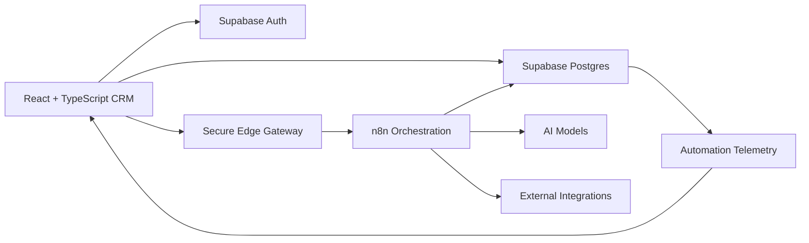
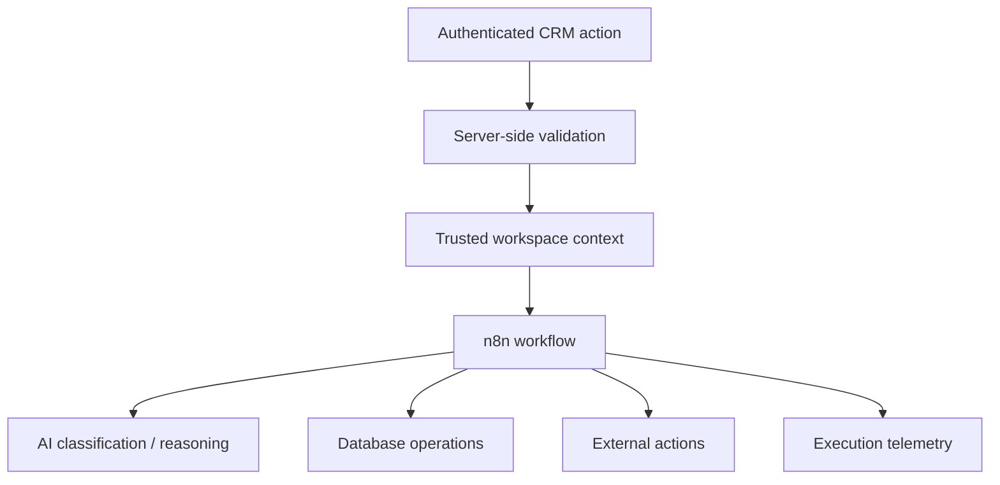

# Smart CRM Portal

**AI-powered sales operations workspace for lead intake, qualification, pipeline management, follow-up automation, reporting, and AI-assisted CRM workflows.**

> This repository is a public engineering case study. The production source, credentials, workflow exports, database migrations, and operational configuration are intentionally kept private.

[Live Project](https://smart-crm-portal.vercel.app/) · [Portfolio](https://www.imedkilat.com/)

## Why I built it

I wanted to build something beyond a one-off automation or a single n8n workflow. Smart CRM Portal became a full workflow-driven application where the UI, database, authentication, AI, automation runtime, and operational safeguards all have to work together.

The project focuses on a practical question:

> How do you let AI and automation help move sales work forward without letting either become the source of truth for critical business data?

That led to an architecture where AI can classify, summarize, recommend, and assist, while authoritative CRM state stays in the application database and protected server-side boundaries.

## What the system does

- Captures leads manually and through structured intake flows
- Classifies lead quality using AI signals such as Hot, Warm, and Cold
- Separates AI lead quality from the actual sales pipeline stage
- Tracks pipeline movement, activities, notes, tasks, and follow-up work
- Uses n8n as an orchestration layer for automation and AI workflows
- Supports an AI Copilot grounded in workspace CRM context
- Tracks automation health and execution telemetry
- Applies workspace isolation and authorization controls
- Uses idempotency and rate limiting on automation boundaries
- Includes billing and entitlement foundations for a multi-tenant SaaS direction
- Supports controlled outbound follow-up workflows with simulation and launch safeguards

## Architecture

The browser does not directly hold private automation credentials. Sensitive automation calls pass through a trusted server boundary that verifies the user and workspace context before forwarding a sanitized request to the orchestration layer.

See [Architecture](docs/ARCHITECTURE.md) for a deeper breakdown.

## Engineering decisions I focused on

### 1. AI is not business truth

AI classification and recommendations are intentionally separate from durable CRM state. A model can suggest that a lead is high quality, but it does not get authority over ownership, billing, permissions, or the sales stage.

### 2. Tenant boundaries belong on the server

Workspace access is enforced through database policies and trusted server-side checks, not only by hiding records in the frontend.

### 3. Automation should be safe to retry

Requests that can create duplicate writes or external side effects use idempotency patterns so a repeated request does not automatically mean a repeated business action.

### 4. External failures should be observable

Important automations write execution state and telemetry so failures can be inspected instead of silently disappearing behind a successful-looking UI.

### 5. Production controls are different from demo logic

Features such as outbound messaging use explicit enablement, simulation modes, limits, and entitlement checks. Being technically possible is not treated as the same thing as being safe to enable.

More detail: [Engineering Decisions](docs/ENGINEERING_DECISIONS.md)

## Tech stack

| Layer | Tools |
| --- | --- |
| Frontend | React, TypeScript, Vite |
| Data / Auth | Supabase Auth, PostgreSQL, Row Level Security |
| Automation | n8n |
| AI | Gemini-based classification and AI workflows |
| Backend boundary | Supabase Edge Functions |
| Testing | Playwright, Node.js verification scripts |
| Deployment | Vercel |
| Integrations | REST APIs, webhook-based services, email provider adapters |

## Selected technical patterns

This public repo includes simplified, sanitized examples of patterns used in the real system. They are not production source files and intentionally omit production endpoints, identifiers, credentials, and proprietary workflow details.

- [Secure automation gateway example](examples/secure-automation-gateway.example.ts)
- [Tenant isolation example](examples/tenant-isolation.example.sql)
- [Idempotency example](examples/idempotency-pattern.example.ts)

## n8n's role

n8n is not being used as a hidden form-to-email automation behind the project. It acts as an orchestration layer between trusted CRM state, AI reasoning, scheduled work, and external integrations.

A simplified flow looks like this:

The production n8n workflow JSON files are private. I keep the public repository focused on architecture, decisions, and selected implementation patterns rather than publishing importable production workflows.

## Reliability and security work

Some of the harder work on this project was not building the screens. It was making the system behave correctly when requests are repeated, users belong to different workspaces, an external integration is unavailable, or an automated action should be suppressed.

Areas I worked through include:

- Row Level Security and workspace-scoped access
- Cross-workspace regression testing
- Server-side workspace resolution
- Idempotency keys for repeated automation requests
- Rate limiting around automation gateways
- Payload and input validation
- Controlled production rollout for automated writes
- Simulation mode for outbound communication
- Automation health and heartbeat telemetry
- Billing entitlement and usage gating
- Regression checks for security-sensitive changes

## What this project demonstrates

I use this project to show how I approach automation beyond connecting two tools together.

The parts I care about most are:

- understanding the system around the workflow
- deciding where trust boundaries belong
- keeping AI away from authoritative state
- handling edge cases before turning automation loose
- combining no-code orchestration with backend code when the workflow needs stronger guarantees
- making failures inspectable instead of hiding them

## Repository boundary

### Public here

- Architecture documentation
- Engineering decisions
- Sanitized code examples
- Product and technical overview
- Non-sensitive diagrams
- Portfolio evidence

### Kept private

- Production n8n workflow JSON
- Production webhook URLs and internal identifiers
- Supabase Edge Function implementation
- Database migrations and complete schema details
- Billing/provider implementation
- Internal QA and rollout scripts
- Credentials, tokens, secrets, and environment configuration

## Project status

Smart CRM Portal is an active portfolio and product engineering project. The live application is available for demonstration, while the production engineering repository remains private so this public repo can stay useful to recruiters without exposing operational implementation details.

## Author

**Ed Rowell Kilat**  
AI Automation Engineer  
[Portfolio](https://www.imedkilat.com/)
