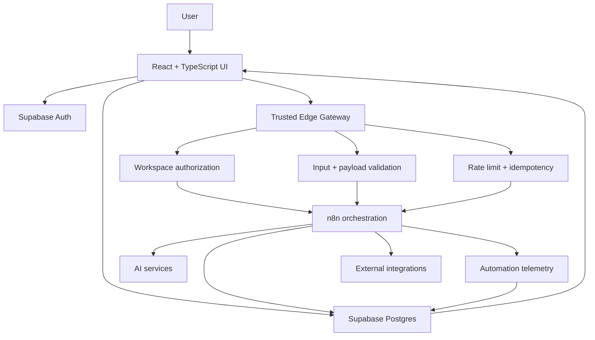
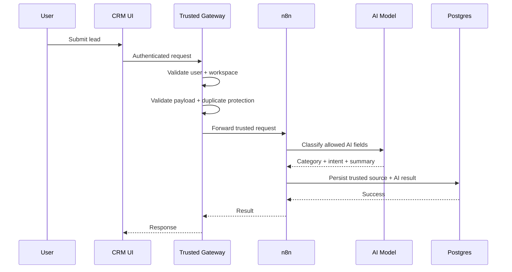

# Smart CRM Architecture

This document describes the public, sanitized architecture of Smart CRM Portal. Production endpoints, secrets, exact database policies, workflow exports, and internal identifiers are intentionally omitted.

## System view



## Responsibilities by layer

### Frontend

The React application is responsible for user interaction, authenticated requests, CRM views, pipeline operations, task management, and surfacing automation state.

The frontend is not treated as a trusted authorization boundary. A hidden button or filtered list is not considered sufficient protection for workspace data.

### Supabase Auth and Postgres

Supabase provides authentication, durable CRM data, and database-level access controls.

Business records are workspace-scoped. Tenant isolation is designed to be enforced below the UI through Row Level Security and server-side authorization.

### Trusted Edge Gateway

Sensitive automation requests pass through a server-side gateway before reaching n8n.

Typical responsibilities include:

- validating the authenticated session
- resolving workspace membership
- rejecting cross-workspace requests
- validating payload shape and allowed values
- applying request-size limits
- reserving idempotency keys
- applying rate limits
- injecting trusted server-side context

This boundary means the browser does not need access to private workflow credentials.

### n8n orchestration

n8n coordinates workflows that are better expressed as multi-step automation rather than synchronous UI logic.

Examples include:

- lead classification
- scheduled follow-up evaluation
- AI-assisted CRM queries
- reporting workflows
- external integration calls
- workflow telemetry

The orchestration layer is deliberately separated from authoritative application permissions.

### AI layer

AI is used for tasks such as classification, summarization, drafting, and contextual assistance.

It does not directly own authoritative state such as:

- workspace membership
- billing status
- permissions
- sales ownership
- final pipeline stage
- immutable record identity

That separation keeps probabilistic model output from becoming a permission or data-integrity boundary.

## Example lead intake path



A key design decision is that AI output is merged with trusted source fields rather than being allowed to reconstruct or overwrite the entire business record.

## Multi-tenant boundary

The intended access model is:

```text
Authenticated user
      ↓
Workspace membership
      ↓
Authorized workspace context
      ↓
Workspace-scoped records
```

Client-provided workspace IDs are treated as requests for context, not as proof of authorization.

## Automation safety model

For actions that can create side effects, Smart CRM uses a combination of:

```text
Authentication
   +
Workspace authorization
   +
Input validation
   +
Rate limiting
   +
Idempotency
   +
Feature / entitlement checks
   +
Telemetry
```

No single mechanism is expected to solve every failure mode.

## Observability

Automation is expected to leave enough evidence to answer:

- what ran?
- for which workspace?
- what triggered it?
- did it succeed, fail, or get suppressed?
- were writes enabled?
- was an external call attempted?

This is especially important for scheduled workflows where there may be no user sitting in front of the UI when something fails.

## Private production details

The public architecture intentionally does not include:

- raw workflow JSON
- exact webhook paths
- production credential references
- internal database IDs
- complete RLS policies
- billing provider internals
- production rollout switches
- operational scripts

Those remain in the private product repository.
